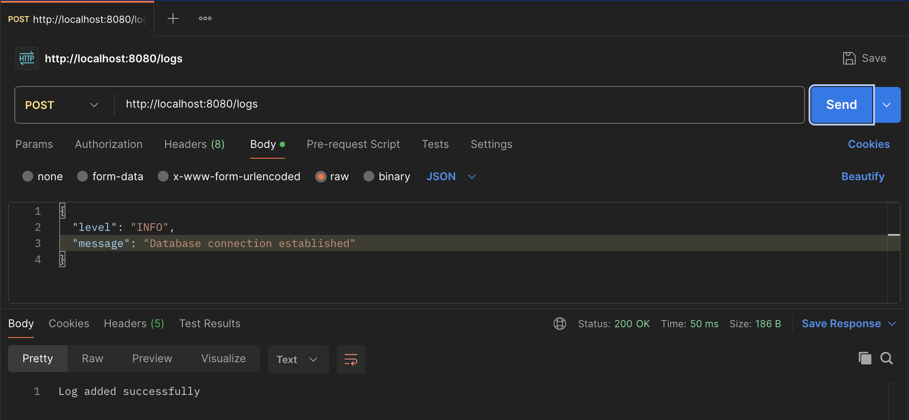
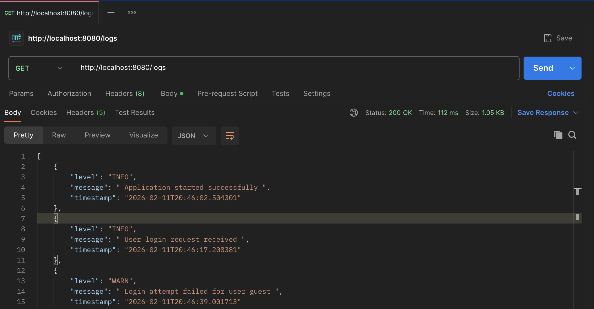
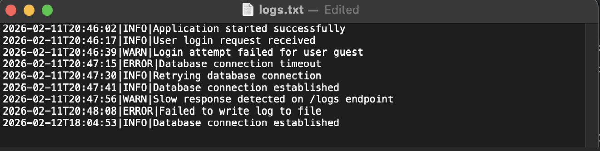

# Custom Logging System – Spring Boot

A 
lightweight backend logging service built with Spring Boot to understand how logging works internally instead of relying entirely on third-party frameworks.

This project focuses on request flow, validation, exception handling, and file-based persistence while keeping the design clean and extensible.

---

## Why This Project?

Most applications use logging frameworks without thinking about what happens underneath.

This project was built to:

- Understand how logs are accepted, validated, stored, and retrieved
- Learn Spring Boot request lifecycle in depth
- Implement clean backend layering (Controller → Service → Model)
- Practice structured exception handling
- Build a small but complete backend system from scratch

This is a learning-focused backend implementation designed to explore internal logging mechanics rather than replace production-grade logging frameworks.

---

## Architecture Overview

```
Client → Controller → Service → Model
                              ↓
                         File Persistence
```

### Request Flow

1. Client sends HTTP request
2. Controller receives and forwards request
3. Service validates input
4. LogEntry object is created with timestamp
5. Log is stored in memory
6. Log is appended to a file
7. Errors are handled centrally

---

## Tech Stack

- Java 21
- Spring Boot
- REST APIs
- Maven
- Java File I/O
- Java Streams & Collections

---

## Project Structure

```
src/main/java/com/example/logsystem
 ├── controller
 │     └── LogController.java
 ├── service
 │     └── LogService.java
 ├── model
 │     └── LogEntry.java
 ├── exception
 │     └── GlobalExceptionHandler.java
 └── LogSystemApplication.java
```

---

## API Endpoints

### Add Log

**POST /logs**

#### Request Body

```json
{
  "level": "INFO",
  "message": "Application started successfully"
}
```

#### Behavior

- Accepts only INFO, WARN, ERROR
- Stores log in memory
- Appends log to file
- Returns 400 Bad Request for invalid levels

---

### Get Logs

Get all logs:

```
GET /logs
```

Filter logs by level:

```
GET /logs?level=ERROR
```

---

## Example: LogEntry Model

```java
public class LogEntry {

    private final String level;
    private final String message;
    private LocalDateTime timestamp;

    public LogEntry(String level, String message) {
        this.level = level;
        this.message = message;
        this.timestamp = LocalDateTime.now();
    }

    @Override
    public String toString() {
        return timestamp + "|" + level + "|" + message;
    }
}
```

---

## Validation Logic (Service Layer)

```java
private static final Set<String> ALLOWED_LEVELS =
        Set.of("INFO", "WARN", "ERROR");

private void validateLevel(String level) {
    if (!ALLOWED_LEVELS.contains(level)) {
        throw new IllegalArgumentException("Invalid log level");
    }
}
```

Validation is handled in the service layer to maintain proper separation of concerns.

---

## Global Exception Handling

```java
@RestControllerAdvice
public class GlobalExceptionHandler {

    @ExceptionHandler(IllegalArgumentException.class)
    public ResponseEntity<String> handleBadRequest(
            IllegalArgumentException ex) {
        return ResponseEntity
                .badRequest()
                .body(ex.getMessage());
    }

    @ExceptionHandler(RuntimeException.class)
    public ResponseEntity<String> handleServerError(
            RuntimeException ex) {
        return ResponseEntity
                .status(HttpStatus.INTERNAL_SERVER_ERROR)
                .body("Internal server error");
    }
}
```

- Centralized error handling
- Clean HTTP responses
- No stack traces exposed to clients

---

## Log File Output

Logs are written to:

```
logs/logs.txt
```

Example output:

```
2026-02-11T15:06:53.402|INFO|Application started
2026-02-11T15:07:01.112|ERROR|Database connection failed
```

The file is created automatically when the first log is added.

---

Screenshots:

 <p align="center">
  
  <br/>
  <em>POST /logs request example</em>
 </p>


<p align="center">
  
  <br/>
  <em>GET /logs request example</em>
 </p>


<p align="center">
  
  <br/>
  <em>Log File  example</em>
 </p>


## Key Learnings

- REST API request lifecycle in Spring Boot
- Service-layer validation patterns
- Global exception handling using `@ControllerAdvice`
- File-based persistence with Java I/O
- In-memory filtering using Streams
- Clean backend architecture

---

## Future Improvements

- Asynchronous log writing
- Pagination support
- Structured JSON logs
- Database persistence
- Log rotation and retention policies
- Unit and integration testing

---

## Final Note

This project represents a transition from using frameworks passively to understanding backend system mechanics.

The goal was clarity, structured design, and practical implementation rather than production-grade complexity.
